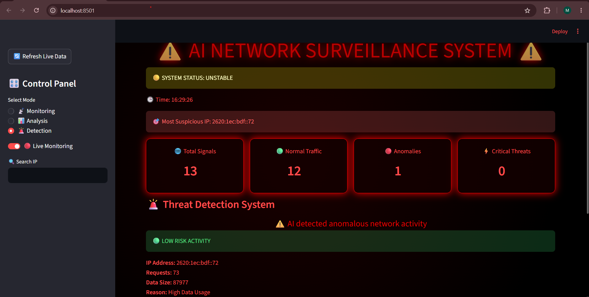

# AI-Powered Network Anomaly Detection and Monitoring System
# Description

This project is an AI-powered network monitoring system that detects abnormal network traffic patterns using machine learning techniques. It combines real-time packet monitoring, anomaly detection, and interactive visualization to identify suspicious network activities.

# Features
- Detects abnormal network traffic patterns
- Uses machine learning for anomaly detection
- Real-time network packet monitoring
- Analyzes network data and identifies outliers
- Interactive dashboard for visualization
- Modular implementation using Python files

# Technologies Used
- Python
- Machine Learning
- Isolation Forest Algorithm
- Scikit-learn
- Pandas
- NumPy
- Streamlit
- Scapy
- Plotly

# How to Run
1. Install dependencies:
    pip install -r requirements.txt
2. Run the application:
    streamlit run app.py

# Output

# Working Principle
The system collects and processes network traffic data to understand normal behaviour patterns.

The machine learning model is trained using network features and applies the Isolation Forest algorithm to identify abnormal observations. Detected anomalies are displayed through the dashboard, allowing users to monitor suspicious network activities.

# Applications
- Network security monitoring
- Intrusion detection systems
- Cybersecurity analysis
- Traffic behaviour analysis
- Threat detection and prevention

# Future Enhancements
- Integration with deep learning based detection models
- Real-time alert notification system
- Cloud deployment
- Advanced threat classification

